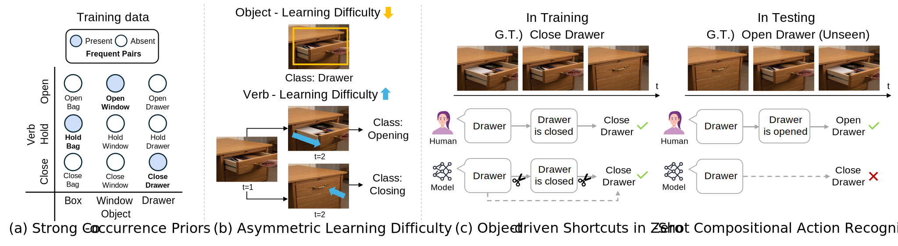

# RCORE: Robust COmpositional REpresentations (ECCV 2026)

<p align="center">
  <a href="https://arxiv.org/pdf/2601.16211"></a>
  <a href="https://ahngeo.github.io/assets/html/RCORE.html"></a>
</p>

<h3 align="center">Why Can't I Open My Drawer? Mitigating Object-Driven Shortcuts in Zero-Shot Compositional Action Recognition</h3>
<p align="center"><strong>ECCV 2026</strong></p>
<p align="center">
  <a href="https://ahngeo.github.io/">Geo Ahn</a><sup>1</sup>, &nbsp;
  <a href="#">Inwoong Lee</a><sup>2</sup>, &nbsp;
  <a href="https://taeoh-kim.github.io/index.html#about">Taeoh Kim</a><sup>2</sup>, &nbsp;
  <a href="#">Minho Shim</a><sup>2</sup>, &nbsp;
  <a href="#">Dongyoon Wee</a><sup>2</sup>, &nbsp;
  <a href="https://sites.google.com/site/jchoivision/">Jinwoo Choi</a><sup>1</sup>
</p>
<p align="center"><sup>1</sup>Kyung Hee University &nbsp;&nbsp; <sup>2</sup>NAVER Cloud</p>

<br>

<p align="center">
  
</p>

---

## Table of Contents

- [Overview](#overview)
- [Installation](#installation)
- [Data Preparation](#data-preparation)
- [Training](#training)
- [Evaluation](#evaluation)
- [Pretrained Checkpoints](#pretrained-checkpoints)
- [Citation](#citation)

---

## Overview

Zero-Shot Compositional Action Recognition (ZS-CAR) requires recognizing novel verb–object combinations composed of previously observed primitives. We identify a key failure mode of existing methods: models predict verbs via **object-driven shortcuts**, relying on the labeled object class rather than temporal evidence. We trace this to (i) sparse and skewed compositional supervision, and (ii) an asymmetry in learning difficulty between verbs and objects.

**RCORE** targets these two root causes with:

- **CPR — Co-occurrence Prior Regularization.** Expands supervision over originally absent verb–object compositions and suppresses frequent training pairs by treating them as hard negatives.
- **TORC — Temporal Order Regularization for Composition.** Enforces temporal-order sensitivity so that verb representations are temporally grounded rather than static.

To diagnose shortcuts, we introduce three quantitative metrics—**FSP**, **FCP**, and the **Compositional Gap**.


## Installation

```bash
conda create -n rcore python=3.10 -y
conda activate rcore
pip install -r requirements.txt
```

`flash-attn` is required by the InternVideo2 1B backbone; skip it if you only run CLIP / InternVideo2-Base.

Download the CLIP BPE vocabulary used by the tokenizer:

```bash
curl -L -o custom_clip/bpe_simple_vocab_16e6.txt.gz \
    https://github.com/openai/CLIP/raw/main/clip/bpe_simple_vocab_16e6.txt.gz
```

## Data Preparation

### Sth-com

Follow the split from [C2C](https://github.com/RongchangLi/ZSCAR_C2C) (built on Something-Something-V2). Pair splits and label dictionaries are provided in [data_split/sth_com/](data_split/sth_com/).

### EK100-com (new in this paper)

EK100-com is a ZS-CAR split repurposed from EPIC-KITCHENS-100 with more severe compositional sparsity than Sth-com (label coverage ratio: ~8% vs. ~14%). Splits are provided in [data_split/ek100-com/](data_split/ek100-com/). Download raw videos from the [EPIC-KITCHENS-100 site](https://epic-kitchens.github.io/).


## Training

Sth-com (CLIP ViT-B/16 backbone):

```bash
torchrun --nproc_per_node=8 train.py --config config/sth_com/sth_ours.yml
```

EK100-com:

```bash
torchrun --nproc_per_node=8 train.py --config config/epic_com/epic_ours.yml
```

Baseline (C2C without RCORE) on Sth-com:

```bash
torchrun --nproc_per_node=8 train.py --config config/sth_com/sth_c2c.yml
```

Training logs and checkpoints are written to `save_path` (set in the config).

### Shortcut diagnostics during training

With `val_with_confusion: True`, **FSP** and **FCP** (with **Verb / Object / Dual-collapse** breakdown, see Section 3.2 of the paper) are printed on every validation pass alongside seen / unseen accuracy. Look for lines like

```
FSP (False Seen Prediction)   : XX.XX%   (N=...)
FCP (False Co-occurrence Prediction, th=...): XX.XX%   (N=...)
  Verb-collapse   : XX.XX%
  Object-collapse : XX.XX%
  Dual-collapse   : XX.XX%
```

in the training stdout / `std_*.out` log under `save_path`. This lets you monitor object-driven shortcut behavior as training progresses. See [engine/evaluate_helper.py](engine/evaluate_helper.py) for the implementation.

## Evaluation

`test.py` supports three evaluation modes.

### Unbiased evaluation (default)

Reports top-1 accuracy (Comp / Verb / Object) and $\Delta_{\text{CG}}$ for **both open-world and closed-world** on the seen and unseen splits, plus their harmonic means.

```bash
torchrun --nproc_per_node=8 test.py --logpath <path-to-training-run>
```

### Biased evaluation

Sweeps a bias term added to unseen-composition logits and reports open-world and closed-world curves.

```bash
torchrun --nproc_per_node=8 test.py --logpath <path-to-training-run> --test_bias
```

### Closed-world AUC 

Computes AUC over the closed-world seen/unseen trade-off.

```bash
torchrun --nproc_per_node=8 test.py --logpath <path-to-training-run> --test_auc
```


## Pretrained Checkpoints

We release checkpoints for the main results on Sth-com and EK100-com.

- **Google Drive:** [RCORE (CLIP)](https://drive.google.com/file/d/1--rycj2SOhDnQoWZfs9JWOnJNNn0JqQb/view?usp=sharing)

## Citation

```bibtex
@inproceedings{ahn2026rcore,
  title     = {Why Can't I Open My Drawer? Mitigating Object-Driven Shortcuts in Zero-Shot Compositional Action Recognition},
  author    = {Ahn, Geo and Lee, Inwoong and Kim, Taeoh and Shim, Minho and Wee, Dongyoon and Choi, Jinwoo},
  booktitle = {ECCV},
  year      = {2026}
}
```

## Acknowledgements

This code builds on [C2C](https://github.com/RongchangLi/ZSCAR_C2C), [CLIP](https://github.com/openai/CLIP), [InternVideo2](https://github.com/OpenGVLab/InternVideo), and [AIM](https://github.com/taoyang1122/adapt-image-models).
